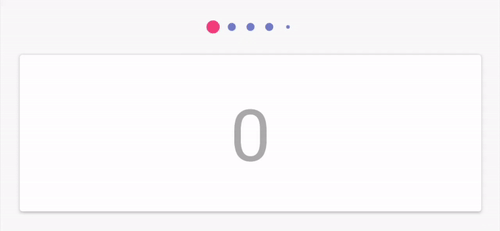
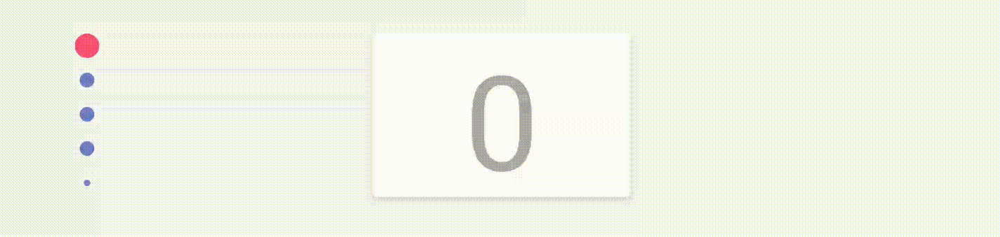

[![Maven Central][img version shield]][maven]

ScrollingPagerIndicator
=======================
Pager indicator inspired by Instagram. Lightweight and easy to set up.

Supports ViewPager, RecyclerView and attaching to custom pagers.





## Getting started
Add dependency to Gradle script:
```Groovy
implementation "ru.tinkoff.scrollingpagerindicator:scrollingpagerindicator:x.x.x"
```
## Attach to ViewPager
1. Ensure that you have ViewPager in dependencies:
```
implementation "androidx.viewpager:viewpager:x.x.x"
```
or
```
implementation "androidx.viewpager2:viewpager2:x.x.x"
```
or
```
implementation "androidx.recyclerview:recyclerview:x.x.x"
```
2. Add view to layout:
```xml
<androidx.viewpager.widget.ViewPager
    android:id="@+id/pager"
    android:layout_width="match_parent"
    android:layout_height="wrap_content" />

<ru.tinkoff.scrollingpagerindicator.ScrollingPagerIndicator
    android:id="@+id/indicator"
    android:layout_width="wrap_content"
    android:layout_height="wrap_content" />
```
There is no possibility to set fixed indicator width (because it's width is based on ```spi_visibleDotCount```).

3. Attach indicator to ViewPager:
```java
ViewPager pager = findViewById(R.id.pager);
pager.setAdapter(new DemoPagerAdapter());
ScaledDotsIndicator indicator = findViewById(R.id.indicator);
indicator.attachToPager(pager);
```
## Attach to RecyclerView
1. Ensure that you have RecyclerView in dependencies:
```
implementation "androidx.recyclerview:recyclerview:x.x.x"
```
2. Add view to layout:
```xml
<androidx.recyclerview.widget.RecyclerView
    android:id="@+id/recycler"
    android:layout_width="match_parent"
    android:layout_height="wrap_content"/>

<ru.tinkoff.scrollingpagerindicator.ScrollingPagerIndicator
    android:id="@+id/indicator"
    android:layout_width="wrap_content"
    android:layout_height="wrap_content" />
```
3. Attach indicator to RecyclerView:
```java
RecyclerView recyclerView = findViewById(R.id.recycler);
LayoutManager layoutManager = new LinearLayoutManager(this, LinearLayoutManager.HORIZONTAL, false);
recyclerView.setLayoutManager(layoutManager);
DemoRecyclerViewAdapter recyclerAdapter = new DemoRecyclerViewAdapter();
recyclerView.setAdapter(recyclerAdapter);

ScrollingPagerIndicator recyclerIndicator = findViewById(R.id.indicator);
recyclerIndicator.attachToRecyclerView(recyclerView);
```
4. Determine which page is current in RecyclerView:

Use ```attachToRecyclerView(RecyclerView)``` if current page of the recycler is centered.
Like this:
```
+------------------------------+
|---+  +----------------+  +---|
|   |  |     current    |  |   |
|   |  |      page      |  |   |
|---+  +----------------+  +---|
+------------------------------+
```
Use ```attachToRecyclerView(RecyclerView recyclerView, int currentPageLeftCornerX)``` if current page of the recycler isn't centered. Like this:
```
+-|----------------------------+
| +--------+  +--------+  +----+
| | current|  |        |  |    |
| |  page  |  |        |  |    |
| +--------+  +--------+  +----|
+-|----------------------------+
  |
  | currentPageLeftCornerX
```
In both cases all views in RecyclerView must have the same width. Only ```LinearLayoutManager``` is supported.
## Attach to any custom pager
If you want to attach indicator to some custom pager, you have to implement ```ScrollingPagerIndicator.PagerAttacher``` interface.
You can take look at ```ru.tinkoff.scrollingpagerindicator.ViewPagerAttacher``` as implementation example.
And then you can attach your pager like this:
```java
indicator.attachToPager(pager, new ViewPagerAttacher());
```
## Customization
| Attribute               | Explanation                                                                                                                                                                                                                                   | Default Value                                                                                       |
|-------------------------|-----------------------------------------------------------------------------------------------------------------------------------------------------------------------------------------------------------------------------------------------|-----------------------------------------------------------------------------------------------------|
| spi_dotSize             | The diameter of a dot.                                                                                                                                                                                                                        | ```6dp```                                                                                           |
| spi_dotSelectedSize     | The diameter of a currently selected dot.                                                                                                                                                                                                     | ```10dp```                                                                                          |
| spi_dotColor            | The color of a dot.                                                                                                                                                                                                                           | ```@android:color/darker_gray```                                                                    |
| spi_dotSelectedColor    | The color of the currently selected dot.                                                                                                                                                                                                      | ```@android:color/darker_gray```                                                                    |
| spi_dotSpacing          | The distance from center to center of each dot.                                                                                                                                                                                               | ```8dp```                                                                                           |
| spi_visibleDotCount     | The maximum number of dots which will be visible at the same time. If pager has more pages than visible_dot_count, indicator will scroll to show extra dots. Must be odd number.                                                              | ```5```                                                                                             |
| spi_visibleDotThreshold | The minimum number of dots which should be visible. If pager has less pages than visibleDotThreshold, no dots will be shown.                                                                                                                  | ```2```                                                                                             |
| spi_looped              | The mode for looped pagers support. You should make indicator looped if your custom pager is looped too. If pager has less items than ```spi_visibleDotCount```, indicator will work as usual; otherwise it will always be in infinite state. | ```false```                                                                                         |
| spi_dotMinimumSize      | The minimum dot size for the corner dots. This size is lower or equal to ```spi_dotSize``` and greater or equal to the internal calculation for the corner dots.                                                                              | Internal calculation based on ```spi_dotSize```, ```spi_dotSelectedSize``` and ```spi_dotSpacing``` |
| spi_orientation         | Visible orientation of the dots                                                                                                                                                                                                               | LinearLayoutManager.HORIZONTAL                                                                      |
| spi_firstDotDrawable    | Custom drawable of the first dot, color is tinted and size is changed like standard dots. If first dot is also the last one then this value is taken into account.                                                                            | `null`                                                                                              |
| spi_lastDotDrawable     | Custom drawable of the last dot, color is tinted and size is changed like standard dots.                                                                                                                                                      | `null`                                                                                              |
| spi_selectedDotDrawable | Custom drawable of the selected dot, color is tinted and size is changed like standard dots.                                                                                                                                                  | `null`                                                                                              |

## TODO
1. Some extreme customizations may work incorrect.
2. There is no possibility to set fixed indicator width (because it's width is based on ```spi_visibleDotCount```).

## License
```
Copyright 2018 Tinkoff Bank

Licensed under the Apache License, Version 2.0 (the "License");
you may not use this file except in compliance with the License.
You may obtain a copy of the License at

   http://www.apache.org/licenses/LICENSE-2.0

Unless required by applicable law or agreed to in writing, software
distributed under the License is distributed on an "AS IS" BASIS,
WITHOUT WARRANTIES OR CONDITIONS OF ANY KIND, either express or implied.
See the License for the specific language governing permissions and
limitations under the License.
```
[img version shield]: https://img.shields.io/maven-central/v/ru.tinkoff.scrollingpagerindicator/scrollingpagerindicator.svg?maxAge=3600
[maven]: https://search.maven.org/#search%7Cga%7C1%7Cg%3A%22ru.tinkoff.scrollingpagerindicator%22
